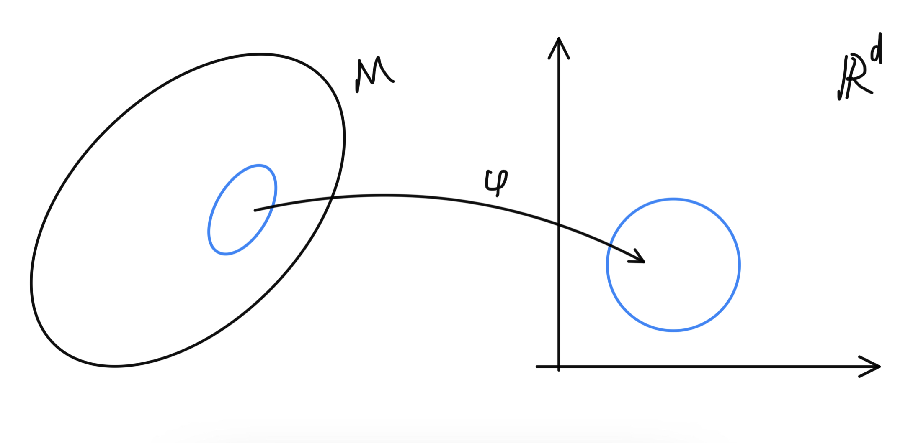

## 多様体の定義

基本的には[教科書](https://press.princeton.edu/absil)の定義に従うが、チャートが同相写像ではなく全単射で定義されていたりして、馴染みが無かったので、細かいところは変えている。

$M$を位相空間とする。$M$の開集合 $U$から $\mathbb{R}^d$ の開集合$V$ への同相写像 $\varphi:U\rightarrow V$がある時 $(U,\varphi)$を$M$の$d$次元の **チャート(chart)**という。誤解の恐れのない場合には $\varphi$ の事をチャートと呼ぶこともある。

点 $x\in U$ に対して $\varphi(x)\in\mathbb{R}^d$ を $x$ のチャート $\varphi(x)$ における**座標(coordinate)**と言う。

チャートは $M$ の局所的な様子を、調べやすいユークリッド空間 $\mathbb{R}^d$ に写しとっていて、 $\varphi(U)$ を通して $U$ について調べることが可能になる。

例えば $M$ を地球、 チャートをある一地方の地図だと思うとイメージしやすい。地球そのものを見なくても、地図上である程度のことは把握できる。

学的な例として例えば $M$ として単位円周 $M=\\{(x,y)\|x^2+y^2=1\\}$ を考える。 $U$ をこの $x>0$ の範囲 $U=\\{(x,y)\|x^2+y^2=1,x>0\\}$ として $$\varphi:U\rightarrow(-\pi/2,\pi/2)$$を
\\[
\varphi(x, y) = \tan^{-1}(y/x)
\\]
とすると $(U,\varphi)$ はチャート。

$M$ を位相空間とする。$M$の $d$次元チャートの集合
 $\\{U_\lambda\\}_{\lambda\in\Lambda}$ で

\\[ M=\bigcup_{\lambda\in\Lambda}U_\lambda \\]

となるものを **アトラス(atlas)**という。

アトラスはチャートを集めた地図帳のようなもの。
    

位相空間 $M$ のアトラス $A$　の2つの交わるチャート $(U_\alpha,\varphi_\alpha),(U_\beta,\varphi_\beta),U_\alpha\cap U_\beta\neq\emptyset$ に対して

\\[ \varphi_\beta\circ\varphi_\alpha:\mathbb{R}^d\rightarrow\mathbb{R}^d \\]

を **座標変換(change of coordinates)**という

上が一般的な定義だが、今回は微分可能多様体に興味があるので、今後アトラスといったら以下の $C^\infty$ アトラス、つまり任意の座標変換が滑らかであるようなアトラスを指す事にする。

位相空間  $M$ のアトラス $A$ の任意の座標変換が $C^\infty$ 級である時これを **$C^\infty$ アトラス** という

$A$と$B$がある位相空間 $M$のアトラスである時、 $A\cup B$もアトラスであるならば $A$ と$B$ は **同値(equivalent)**であるという。

アトラスの同値が、実際に同値関係である事は明らか。

位相空間 $M$ のアトラス $A$ に対して、 $A$ と同値な全てのアトラスを含むアトラスを **極大アトラス(maximal atlas)** といい、 $A^+$ と表す。

