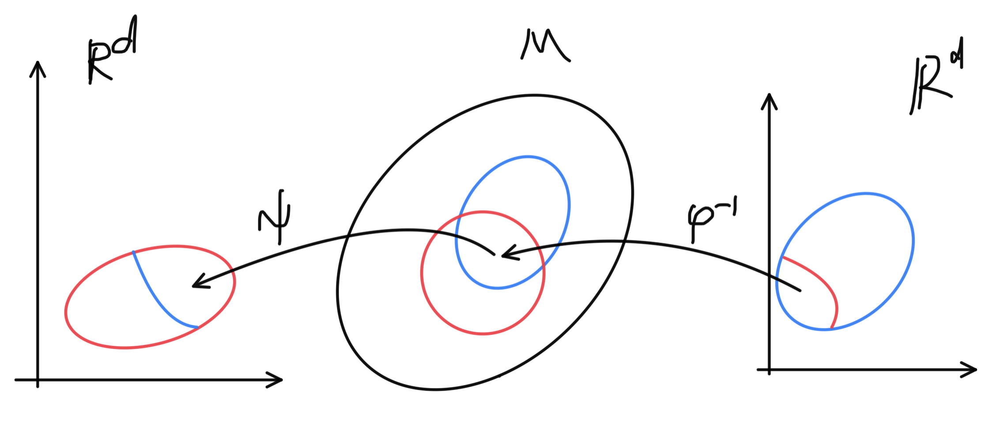

[教科書](https://press.princeton.edu/absil)の多様体の定義では、よくある(?)定義と異なって極大アトラスを用いるものになっている。
よくある定義では多様体 $\mathcal{M}$ の位相空間的な構造が天下り的に与えられる事が多いけど、今から多様体と見なして分析しようとしている空間の構造が予め与えられるというのは違和感がある。

教科書の定義では $\mathcal{M}$ は単なる集合として導入されて、 $\mathcal{M}$ 上のチャートの集合によって構造を入れるというより自然な感じな流れになっている。少し抽象論的で難しいが、これに従ってノートを取る。

また、今回関心があるのは可微分多様体であるので、以下特に断りなく多様体と言ったら可微分多様体の事とする。

 チャート 

$\mathcal{M}$を集合とする。$\mathcal{M}$の部分集合 $U$からユークリッド空間 $\mathbb{R}^d$ の開集合$V$ への全単射 $\varphi:U\rightarrow V$がある時 $(U,\varphi)$を$\mathcal{M}$の$d$次元の **チャート(chart)**という。誤解の恐れのない場合には $U$ や $\varphi$ の事を単体でチャートと呼ぶこともある。

点 $x\in U$ に対して $\varphi(x)\in\mathbb{R}^d$ を $x$ のチャート $\varphi(x)$ における**座標(coordinate)**と言う。

チャートを使って、$\mathcal{M}$ の局所的な様子を調べやすいユークリッド空間 $\mathbb{R}^d$ に写しとる事で、 $\varphi(U)$ を通して $U$ について調べることが可能になる。

例えば $\mathcal{M}$ を地球、 チャートをある一地方の地図だと思うとイメージしやすい。地球そのものを見なくても、地図上である程度のことは把握できる。

 定義:チャートの両立 

2つの$d$次元チャート $(U,\varphi),(V,\psi)$ に対して

\\[ \psi\circ\varphi^{-1}: \varphi(U\cap V)\rightarrow\psi(U\cap V) \\]
を **座標変換(change of coordinates)**という。

$\varphi(U\cap V), \psi(U\cap V)$ がどちらも $\mathbb{R}^d$ の開集合であり、$\psi\circ\varphi^{-1}$ が($C^\infty$) 微分同相写像であるとき、2つのチャートは **両立する(compatible)**という。

2つの地図に重なっている地域があるならば、一方の地図ともう一方の地図の対応を付けられるということで、これらの地図が両立するというのはその対応が滑らかな写像になっているということ。

特別な場合として交わらないチャートは常に両立する。なぜならば $U\cap V=\emptyset$ ならば
$\varphi$ は全単射だから $\varphi(U\cap V)=\emptyset$。よってこれは $\mathbb{R}^d$ の開集合。 $\psi(U\cap V)$ も同じく開集合。
$\psi\circ\varphi^{-1}$ は空写像になるが、空写像は微分同相。

チャート $(U,\varphi)$ と $U$の部分集合 $V\subset U$ について $\varphi(V)$ が $\mathbb{R}^d$ の開集合ならば、 $(V,\varphi\|_V)$ もチャートである。但し、 $\varphi\|_V$ は $\varphi$ の定義域を $V$ に制限した写像。これは、これらの間の座標変換が恒等写像になる事から明らか。地図をその一部にだけ注目しても地図である事は変わらないという事。

両立関係は同値関係とは限らない。3つのチャート $(U,\varphi),(V,\psi),(W,\xi)$ について前者2つ、後者2つが両立しても $\varphi(U\cap W),\xi(U\cap W)$ が $\mathbb{R}^d$ の開集合とは限らない為、推移律が成り立たない。

 アトラス 

$\mathcal{M}$ を集合とする。$\mathcal{M}$の $d$次元チャートの集合
 $\\{(U_\lambda,\varphi_\lambda\\}$ で

\\[ \mathcal{M}=\bigcup_\lambda U_\lambda \\]

であり、任意の2つのチャートが両立するものを
 $d$次元 **アトラス(atlas)**という。

アトラスは地図を集めた地図帳。

---
2次元単位球面のアトラスの例:

$S^2=\\{(x,y,z)\|x^2+y^2+z^2=1\\}$ について $U_+=S^2\setminus\\{(0,0,-1)\\},U_-=S^2\setminus\\{(0,0,1)\\}$
とする。$U_+$ は$S^2$の南極一点を除いた集合、$U_-$ は北極一点を除いた集合。
$\varphi_+:U_+\rightarrow \mathbb{R}^2: p\rightarrow\varphi_+(p)$ を、 $p$を$(0,0,-1)$と$p$を通る直線が平面 $z=0$ と交わる点に移す写像とする(南極点から$xy$平面への射影)。同様に $\varphi_-:U_-\rightarrow\mathbb{R}^2$ を北極点からの射影と定義する。このとき $\\{(U_+,\varphi_+),(U_-,\varphi_-)\\}$ は $S^2$ のアトラスとなる。

実際に計算してみると
\\[
\varphi_+(x,y,z)=\left(\frac{x}{1+z},\frac{y}{1+z}\right),\quad
\varphi_-(x,y,z)=\left(\frac
{x}{1-z},\frac{y}{1-z}\right) 
\\]
となる。これらの逆写像は
\\[
\begin{aligned}
\varphi_+^{-1}(u,v)&=\left(\frac{2u}{u^2+v^2+1},\frac{2v}{u^2+v^2+1},-\frac{u^2+v^2-1}{u^2+v^2+1}\right) \\\\ \\\\
\varphi_-^{-1}(u,v)&=\left(\frac{2u}{u^2+v^2+1},\frac{2v}{u^2+v^2+1},\frac{u^2+v^2-1}{u^2+v^2+1}\right)
\end{aligned}
\\]

となり、確かに $\varphi_+,\varphi_-$ は全単射で $\mathbb{R}^2$ は開集合だから、これらはチャートである。

次に座標変換について調べるが、まず
$\varphi_+(U_+\cap U_-)=\varphi_-(U_+\cap U_-)=\mathbb{R}\setminus\{(0,0)\}$ はユークリッド空間 $\mathbb{R}^2$ の開集合である。(一点集合は閉集合だから)

座標変換 $\varphi_-\circ\varphi_+^{-1}$ は

\\[
\varphi_-\circ\varphi_+^{-1}(u,v)=\left(\frac{u}{u^2+v^2},\frac{v}{u^2+v^2}\right)
\\]

となるが、これは $\mathbb{R}\setminus\\{(0,0)\\}$ 上の微分同相写像である。以上より2つのチャートは両立し、$S^2=U_+\cup U_-$ なので $\\{(U_+,\varphi_+),(U_-,\varphi_-)\\}$ は $S^2$ のアトラス。

---
馴染みのない例:

$\mathcal{M}$ を $\mathbb{R}^2$ 内の直線の集合とし、$U$ を $y$ 軸に並行ではない直線の集合、$V$ を $x$ 軸に並行ではない直線の集合とする。つまり

\\[
U=\\{y=mx+b\|m,b\in\mathbb{R}\\},
V=\\{x=ny+c\|n,c\in\mathbb{R}\\}
\\]

とかける。ここで
\\[
\begin{aligned}
\varphi&:U\rightarrow\mathbb{R}^2:\varphi(y=mx+b)=(m,b)\\\\\\\\
\psi&:V\rightarrow\mathbb{R}^2:\psi(x=ny+c)=(n,c)\\\\\\\\
\end{aligned}
\\]
と置くとこれらはチャートになる。$U\cap V$ は水平でも並行でもない直線の集合で $\varphi(U\cap V)=\psi(U\cap V)=\\{(a,b)\|a,b\in\mathbb{R},a\neq 0\\}$ になる。これは $\mathbb{R}^2$ の開集合で $\psi\circ\varphi^{-1}:(m,b)\mapsto(1/m,b/m)$ は $m\neq 0$ で微分同相。$U\cup V=\mathcal{M}$ だから $\\{(U,\varphi),(V,\psi\\}$ は$\mathcal{M}$ のアトラス)。

---

 極大アトラス 

集合 $\mathcal{M}$ の$d$次元チャート $(U,\varphi)$ とアトラス $\mathcal{A}$ について $\mathcal{A}\cup\\{(U,\varphi)\\}$ も $\mathcal{M}$ のアトラスであるならば、 $(U,\varphi)$ は $\mathcal{A}$ と両立するという。

アトラス $\mathcal{A}$ と両立するチャート全ての集合 $\mathcal{A}^+$ を $\mathcal{A}$の**極大アトラス(maximal atlas)**という。

つまり極大アトラス $\mathcal{A}^+$ は $\mathcal{A}$ を含む最大のアトラス。

---

$\mathcal{A}$が$\mathcal{A}^+$に含まれるのは明らか。
$\mathcal{A}^+$ 自身もアトラスになるという事は、あまり自明ではないと思うから証明する。
その為には $\mathcal{A}^+$ に含まれる任意の2つのチャート $(U,\varphi),(V,\psi)$ が両立する事を示せば良いが、一方が $\mathcal{A}$ に含まれているならばこれらが両立するのは定義より明らか。よって、これらが $\mathcal{A}$ に含まれていない時にも両立する事を示せば良い。

それぞれのチャートは $\mathcal{A}$ と両立するので, 任意の$(U_\alpha,\varphi_\alpha)\in \mathcal{A}$ について
$\varphi_\alpha(U\cap U_\alpha),\varphi_\alpha(V\cap U_\alpha)$ は $\mathbb{R}^d$ の開集合。従ってこれらの共通部分

\\[ 
\varphi_\alpha(U\cap U_\alpha)\cap\varphi_\alpha(V\cap U_\alpha) = \varphi_\alpha(U\cap V\cap U_\alpha)
\\]

も開集合。($\because$ $f$が全単射ならば $f(A\cap B)=f(A)\cap f(B)$)

よって$\varphi\circ\varphi_\alpha$ は同相写像だから

\\[
\varphi(U\cap V\cap U_\alpha)=(\varphi\circ\varphi_\alpha^{-1})(\varphi_\alpha(U\cap V\cap U_\alpha))
\\]

も $\mathbb{R}^d$ の開集合。よって

\\[
\varphi(U\cap V)=\varphi\left(\bigcup_\alpha U\cap V\cap U_\alpha\right) = \bigcup_\alpha\varphi(U\cap V\cap U_\alpha)
\\]

も開集合。全く同様にして $\psi(U\cap V)$ も開集合。

あとは座標変換 $\psi\circ\varphi^{-1}:\varphi(U\cap V)\rightarrow\psi(U\cap V)$が微分同相写像である事を示せば良い。任意の $(U_\alpha,\varphi_\alpha)\in \mathcal{A}$ に対して、

\\[\varphi_\alpha\circ\varphi^{-1}:\varphi(U\cap U_\alpha)\rightarrow\varphi_\alpha(U\cap U_\alpha)\\]

は仮定より微分同相写像。これを開集合 $\varphi(U\cap V\cap U_\alpha)$ に制限した

\\[\varphi_\alpha\circ\varphi^{-1}:\varphi(U\cap V\cap U_\alpha)\rightarrow\varphi_\alpha(U\cap V\cap U_\alpha)\\]

も微分同相写像。$\psi\circ\varphi_\alpha^{-1}$ も同様なので、これらの合成

\\[\psi\circ\varphi^{-1}:\varphi(U\cap V\cap U_\alpha)\rightarrow\psi(U\cap V\cap U_\alpha)\\]

も微分同相写像。よって $$\varphi(U\cap V)= \bigcup_\alpha\varphi(U\cap V\cap U_\alpha)$$ であったので
\\[ \psi\circ\varphi^{-1}: \varphi(U\cap V)\rightarrow\psi(U\cap V) \\]
も微分同相写像である。以上より $(U,\varphi),(V,\psi)$ は両立する。

---

以上で多様体の定義に必要な道具は揃ったが、実用上2つの条件を加える。1つは $\mathcal{M}$ が可算個のチャートで覆えるということ、もう一つはハウスドルフ性である。これらが具体的にどう役に立つかは(私もまだ勉強途中でよく分からないので)あとで、実際に使う場面で見る。

 多様体 

集合 $\mathcal{M}$ と$d$次元極大アトラス $\mathcal{A}=\\{(U_\alpha,\varphi_\alpha)\\}$ が以下を満たすとき、 $(\mathcal{M},\mathcal{A})$ を **$d$次元多様体($d$-dimentional manifold)** という。誤解の恐れの無い場合は $\mathcal{M}$ 自身を多様体と呼ぶ。

*可算被覆をもつ(Countability condition)**

$\mathcal{M}$ は $\mathcal{A}$ の可算個のチャートで覆うことができる。つまり、$U_{\alpha_1},U_{\alpha_2},\ldots$ が存在して $ \mathcal{M}=\bigcup_iU_{\alpha_i}$ と書ける。

**ハウスドルフ性(Hausdorff condition)**

任意の異なる点 $x,y\in \mathcal{M},x\neq y$ に対して、これらを含む交わらないチャート,すなわち $(U,\varphi),(V,\psi)\in \mathcal{A}$ で$x\in U,y\in V$ かつ $U\cap V=\emptyset$であるものが存在する。

ある集合と極大アトラスがハウスドルフ性を満たすか調べる為には、以下の補題が役に立つ。

$\mathcal{M}$ を集合、 $\mathcal{A}$ を極大アトラスとする。
$\mathcal{M}$ の異なる2点 $x,y$ がある1つのチャート $(U,\varphi)\in \mathcal{A}$ に含まれるならば、これらを分離する $U$ に含まれるチャートが存在する。

すなわち、あるチャート $U_\alpha,U_\beta\subset U$ が存在して $x\in U_\alpha,y\in U_\beta,U_\alpha\cap U_\beta=\emptyset$

つまり、一つの地図の中に限って見ればハウスドルフ性は自然に成立するということ。

$\varphi$ は全単射だから $x\neq y$ の時、$\varphi(x)\neq\varphi(y)$ である。よって $\mathbb{R}^d$ はハウスドルフ空間だから $\varphi(x),\varphi(y)$ を分離する開集合で $\varphi(U)$ に含まれる物を選ぶ事ができる。これらの $\varphi$ での逆像を $U_\alpha,U_\beta$ とすれば $U_\alpha,U_\beta\subset U$ であって $\varphi$ は全単射だから $U_\alpha\cap U_\beta=\emptyset$ となる。それぞれのチャートの写像は $\varphi$ を $U_\alpha,U_\beta$ に制限したものをとれば良い。

---

ここでよく使うことになりそうな多様体の例を挙げる。

 $n$次元球面 

\\[
S^n=\\{\mathbf{x}\|\mathbf{x}\in\mathbb{R}^{n+1},||\mathbf{x}||=1\\}
\\]

を **$n$ 次元球面($n$-sphere)**という。
$U_\pm$ を $S^n$ から $(\mp 1,0,\ldots)$ を除いた集合とし, 写像 $\varphi_\pm :U_\pm\rightarrow\mathbb{R}^n$ を
\\[
\varphi_\pm(x_0,x_1,\ldots,x_n) = \frac{1}{1\pm x_0}(x_1,\ldots,x_n)
\\]
とすると $(U_\pm,\varphi_\pm)$ はチャートである。また、 $\mathcal{A}=\\{(U_+,\varphi_+),(U_-,\varphi_-)\\}$ はアトラスであり、 $(S^n,\mathcal{A}^+)$ は$n$次元多様体である。

$\varphi_\pm$ がチャートである事と、$\mathcal{A}$ がアトラスである事の証明は 前節でやった $S^2$ の場合とほとんど同じなので省略し、極大アトラス $\mathcal{A}^+$ をとると $(S^n,\mathcal{A}^+)$ が多様体になる事を示す。

まず $S^n=U_+\cup U_-$ だから可算被覆を持つ事は明らか。続いて、ハウスドルフ性についてだが、補題2.1より2点が同じチャートに含まれる場合には分離できるので、$(1,0,\ldots)$ と $(-1,0,\ldots)$ を分離するチャートが存在する事を示せば良い。

$V_+$ を $U_+$ の $x_0>0$ の部分、 $V_-$ を $U_-$ の $x_0<0$ の部分とすれば

\\[ \varphi_+(V_+)=\varphi_-(V_-)=\\{\mathbf{x}\|\mathbf{x}\in\mathbb{R}^n,\|\|\mathbf{x}\|\|>1\\} \\]

となって、これらは $\mathbb{R}^n$ の開集合($\because$ 閉球体の補集合)だから、$\varphi_\pm$ のこれらへの制限は $S^n$ のチャートになる。
そして $V_+\cap V_-=\emptyset$ だから、これらは $(\pm 1,0,\ldots)$ を分離する。以上より $(S^n,\mathcal{A}^+)$ はハウスドルフ性を満たす。

よって $(S^n,\mathcal{A}^+)$ は $n$ 次元多様体である。

 一般線形化群 

正則な $n$次実正方行列の集合 $GL_n=\\{X\in\mathbb{R}^{n\times n}\|\det X\neq 0\\} $ 
に対して、写像
\\[
\varphi:GL_n\rightarrow\mathbb{R}^{n^2}: X\mapsto\mathrm{vec}(X)
\\]
を考えると $\mathcal{A}=\\{(GL_n,\varphi)\\}$ がアトラスとなり、 $(GL_n,\mathcal{A}^+)$ は $n^2$次元多様体となる。

ここで $\mathrm{vec}(X)$ は $X$ の各列を縦に繋げたベクトル。

まず $\varphi(GL_n)$ が開集合である事を示す。$\det'=\det\circ\mathrm{vec}^{-1}:\mathbb{R}^{n^2}\rightarrow\mathbb{R}$ はベクトルの成分の加減乗算のみで定義されるので連続。従って $\varphi(GL_n)=\det'^{-1}(\mathbb{R}\setminus\\{0\\})$ は開集合。($\because$ ユークリッド空間の一点集合 $\\{0\\}$ は閉集合だから、その補集合である $\mathbb{R}\setminus\\{0\\}$ は開集合。そして、開集合の連続写像による逆像は開集合。)

そして $\mathrm{vec}$ は全単射だから $(GL_n,\varphi)$ はチャートである。$GL_n$ 全体が一つのチャートで覆われるので、可算被覆を持つことは明らか。ハウスドルフ性も補題2.1より明らか。

---

同じようにして特殊線形化群 $SL_n=\\{X\in\mathbb{R}^{n\times n}\|\det X=1\\}$ などについても考えたいが、同じようにチャートを与える事によって直接示すのは大変なので、いくつか定理を示した後にする。
